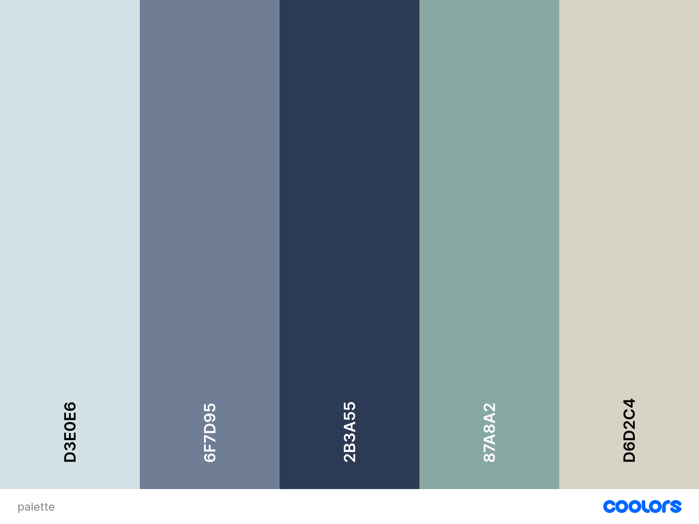

# JS-FileTransferApp

### About the Project

A file tranfer application in JavaScript using the MERN stack.

### Dependencies

- Express; routing and server-side logic
- Mongoose; integrating MongoDB database
- Multer; middleware to handle file uploads.
- React + Tailwind for front-end
- Bcrypt; hashing password for security. [to be expanded]
- Jest(Testing Framework) + Supertest(HTTP Endpoints)

### Deployment

[TO BE IMPLEMENTED]

## Development Commands

Run this command to get a copy of the project in your own machine.

```
git clone https://github.com/vonner04/JS-FileTransferApp.git
```

If starting fresh, run two terminals for:

#### Starting the server:

Only run npm install if you don't have the dependencies above.

```
cd back-end
npm install
npm run devStart
```

#### Starting the front-end:

```
cd front-end
npm install
npm run dev
```

### Testing

Navigate to back-end folder and use either:

```c
npm test integration
npm test unit
npm test //to run both unit and integration tests
```

## Pending Features

- Allow users to generate a unique code which contains files.
- When this code is entered the file transferred from one machine to another.
- Allow users to send bulk files in folders, create folder instances.
- Personalise user files by allowing them to create accounts which contains file they sent and their recent transfers.
- Show information of their participated recent transfer. Have UI to show the type of device used, name of device and public I.P?

### Website Color Palette

<div align="center">
  
</div>

## License

[MIT](https://choosealicense.com/licenses/mit/)
